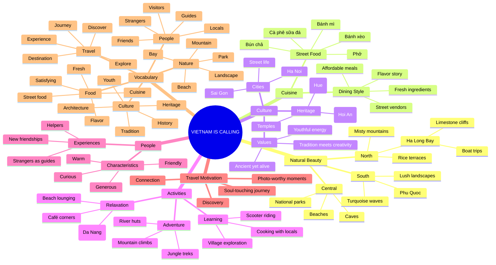

```mermaid
mindmap
  root((VIETNAM IS CALLING))
    Natural Beauty
      North
        Rice terraces
        Misty mountains
        Ha Long Bay
          Limestone cliffs
          Boat trips
      Central
        Caves
        Beaches
        National parks
      South
        Phu Quoc
        Turquoise waves
        Lush landscapes
    Cuisine
      Street Food
        Phở
        Bánh mì
        Bún chả
        Bánh xèo
        Cà phê sữa đá
      Dining Style
        Street vendors
        Affordable meals
        Fresh ingredients
        Flavor story
    Culture
      Heritage
        Temples
        Royal architecture (Hue)
        Old town (Hoi An)
      Cities
        Ha Noi
        Sai Gon
        Street life
      Values
        Ancient yet alive
        Youthful energy
        Tradition meets creativity
    Activities
      Adventure
        Jungle treks
        Mountain climbs
        River huts
      Relaxation
        Beach lounging
        Rooftop bars (Da Nang)
        Café corners
      Learning
        Cooking with locals
        Scooter riding
        Village exploration
    People
      Characteristics
        Warm
        Friendly
        Generous
        Curious
      Experiences
        Strangers as guides
        Helpers
        New friendships
    Travel Motivation
      Connection
      Discovery
      Soul-touching journey
      Photo-worthy moments
    Vocabulary
      Travel
        Destination
        Journey
        Explore
        Discover
        Experience
      Food
        Cuisine
        Flavor
        Fresh
        Satisfying
        Street food
      Nature
        Landscape
        Mountain
        Bay
        Beach
        Park
      Culture
        Heritage
        Tradition
        Architecture
        Youth
        History
      People
        Locals
        Strangers
        Friends
        Guides
        Visitors

```